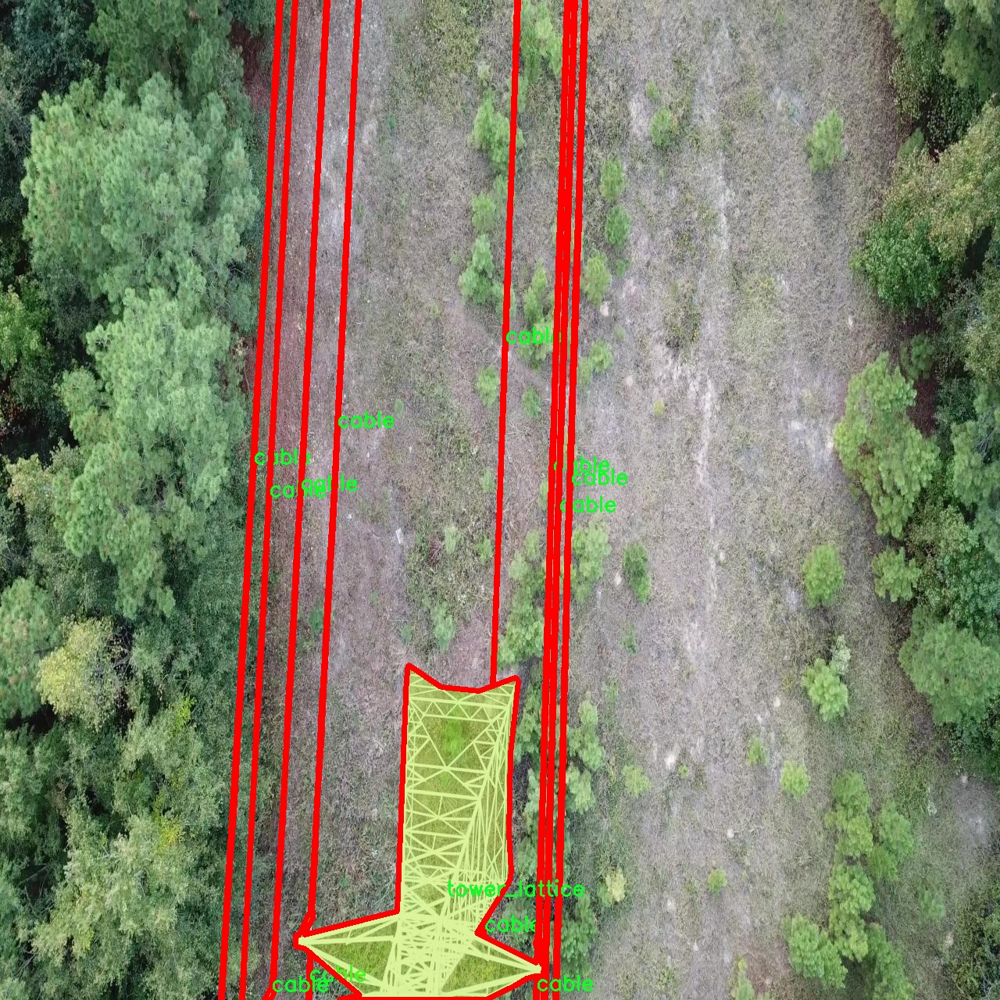

# 输电线路塔电缆检测分割系统源码＆数据集分享
 [yolov8-seg-goldyolo＆yolov8-seg-C2f-ContextGuided等50+全套改进创新点发刊_一键训练教程_Web前端展示]

### 1.研究背景与意义

项目参考[ILSVRC ImageNet Large Scale Visual Recognition Challenge](https://gitee.com/YOLOv8_YOLOv11_Segmentation_Studio/projects)

项目来源[AAAI Global Al lnnovation Contest](https://kdocs.cn/l/cszuIiCKVNis)

研究背景与意义

随着全球电力需求的不断增长，输电线路的安全性和可靠性愈发重要。输电线路塔及其电缆的健康状态直接关系到电力系统的稳定运行，任何故障都可能导致大规模停电，甚至引发严重的安全事故。因此，针对输电线路塔和电缆的检测与维护显得尤为重要。传统的人工巡检方式不仅效率低下，而且容易受到天气、环境等因素的影响，导致漏检或误检现象的发生。近年来，计算机视觉技术的快速发展为输电线路的检测提供了新的解决方案，尤其是基于深度学习的目标检测与分割技术，能够在复杂环境中实现高效、准确的目标识别。

YOLO（You Only Look Once）系列模型因其高效的实时检测能力而广泛应用于各类视觉任务。YOLOv8作为该系列的最新版本，具备更强的特征提取能力和更高的检测精度，能够有效应对复杂背景下的目标检测任务。然而，针对输电线路塔及电缆的特定需求，YOLOv8的标准模型可能无法完全满足实际应用的要求。因此，基于YOLOv8的改进模型，将为输电线路塔电缆的检测与分割提供更为精准的解决方案。

本研究将构建一个基于改进YOLOv8的输电线路塔电缆检测分割系统，旨在实现对输电线路塔及其电缆的自动化检测与分割。我们将使用包含2400张图像的数据集，涵盖四个类别：电缆、塔架（包括格构塔和木塔）。该数据集的多样性将为模型的训练提供丰富的样本，增强其在不同环境下的适应能力。通过对图像中不同类别的目标进行实例分割，不仅可以提高检测的准确性，还能为后续的故障分析和维护决策提供更为详尽的信息。

本研究的意义在于，通过引入先进的深度学习技术，提升输电线路塔及电缆的检测效率和准确性，从而降低人工巡检的成本和风险。同时，改进YOLOv8模型的应用，将为电力行业提供一种高效、智能的检测工具，推动输电线路的智能化管理。此外，研究成果还可为其他领域的目标检测与分割任务提供借鉴，具有广泛的应用前景。

综上所述，基于改进YOLOv8的输电线路塔电缆检测分割系统的研究，不仅具有重要的理论价值，也具有显著的实际应用意义。通过这一研究，我们希望能够为电力行业的安全运营提供有力支持，推动智能电网的建设与发展。

### 2.图片演示


##### 注意：由于此博客编辑较早，上面“2.图片演示”和“3.视频演示”展示的系统图片或者视频可能为老版本，新版本在老版本的基础上升级如下：（实际效果以升级的新版本为准）

  （1）适配了YOLOV8的“目标检测”模型和“实例分割”模型，通过加载相应的权重（.pt）文件即可自适应加载模型。

  （2）支持“图片识别”、“视频识别”、“摄像头实时识别”三种识别模式。

  （3）支持“图片识别”、“视频识别”、“摄像头实时识别”三种识别结果保存导出，解决手动导出（容易卡顿出现爆内存）存在的问题，识别完自动保存结果并导出到tempDir中。

  （4）支持Web前端系统中的标题、背景图等自定义修改，后面提供修改教程。

  另外本项目提供训练的数据集和训练教程,暂不提供权重文件（best.pt）,需要您按照教程进行训练后实现图片演示和Web前端界面演示的效果。

### 3.视频演示

[3.1 视频演示](https://www.bilibili.com/video/BV1ARyHYQEbu/)

### 4.数据集信息展示

##### 4.1 本项目数据集详细数据（类别数＆类别名）

nc: 4
names: ['cable', 'tower_lattice', 'tower_tucohy', 'tower_wooden']


##### 4.2 本项目数据集信息介绍

数据集信息展示

在本研究中，我们使用了名为“Cable detection”的数据集，以训练和改进YOLOv8-seg模型，旨在实现对输电线路塔电缆的高效检测与分割。该数据集的设计考虑了输电线路塔及其周边环境的复杂性，涵盖了多种类型的目标对象，具体包括四个主要类别：电缆（cable）、塔架（tower_lattice）、涂层塔架（tower_tucohy）和木质塔架（tower_wooden）。这些类别的选择反映了输电线路塔在实际应用中的多样性与复杂性，为模型的训练提供了丰富的样本。

数据集中包含的“电缆”类别是我们研究的核心目标，代表了输电线路中至关重要的组成部分。电缆的检测与分割不仅关乎输电系统的安全性，还直接影响到电力的稳定传输。因此，准确识别电缆的位置和形状是实现高效监测和维护的基础。通过对电缆的精确分割，系统能够在复杂的环境中有效区分电缆与其他物体，从而提高检测的准确性。

“塔架”类别则分为两种类型：塔架（tower_lattice）和涂层塔架（tower_tucohy）。塔架通常由金属材料构成，具有复杂的几何形状，而涂层塔架则是为了防腐蚀和美观而施加了特殊涂层的塔架。这两种塔架在结构上存在显著差异，因此在模型训练中需要特别关注它们的特征提取与分类。通过对这两种塔架的准确识别，系统能够有效监测输电线路的结构健康，及时发现潜在的安全隐患。

最后，木质塔架（tower_wooden）作为一种传统的输电塔架类型，虽然在现代输电系统中逐渐被金属塔架所取代，但在某些地区仍然发挥着重要作用。木质塔架的识别对于维护老旧输电线路的安全性同样不可忽视。数据集中包含的多样化样本为模型提供了丰富的训练数据，使其能够在不同环境和条件下保持较高的检测性能。

总的来说，“Cable detection”数据集的构建充分考虑了输电线路塔及其电缆的多样性与复杂性，为YOLOv8-seg模型的训练提供了坚实的基础。通过对四个类别的全面覆盖，数据集不仅提高了模型在不同场景下的适应能力，也为后续的研究和应用奠定了良好的基础。随着模型的不断优化与迭代，我们期望能够实现更高效、更准确的输电线路塔电缆检测与分割，进而推动电力行业的智能化发展。





### 5.全套项目环境部署视频教程（零基础手把手教学）

[5.1 环境部署教程链接（零基础手把手教学）](https://www.bilibili.com/video/BV1jG4Ve4E9t/?vd_source=bc9aec86d164b67a7004b996143742dc)


[5.2 安装Python虚拟环境创建和依赖库安装视频教程链接（零基础手把手教学）](https://www.bilibili.com/video/BV1nA4VeYEze/?vd_source=bc9aec86d164b67a7004b996143742dc)

### 6.手把手YOLOV8-seg训练视频教程（零基础小白有手就能学会）

[6.1 手把手YOLOV8-seg训练视频教程（零基础小白有手就能学会）](https://www.bilibili.com/video/BV1cA4VeYETe/?vd_source=bc9aec86d164b67a7004b996143742dc)


按照上面的训练视频教程链接加载项目提供的数据集，运行train.py即可开始训练



     Epoch   gpu_mem       box       obj       cls    labels  img_size
     1/200     0G   0.01576   0.01955  0.007536        22      1280: 100%|██████████| 849/849 [14:42<00:00,  1.04s/it]
               Class     Images     Labels          P          R     mAP@.5 mAP@.5:.95: 100%|██████████| 213/213 [01:14<00:00,  2.87it/s]
                 all       3395      17314      0.994      0.957      0.0957      0.0843

     Epoch   gpu_mem       box       obj       cls    labels  img_size
     2/200     0G   0.01578   0.01923  0.007006        22      1280: 100%|██████████| 849/849 [14:44<00:00,  1.04s/it]
               Class     Images     Labels          P          R     mAP@.5 mAP@.5:.95: 100%|██████████| 213/213 [01:12<00:00,  2.95it/s]
                 all       3395      17314      0.996      0.956      0.0957      0.0845

     Epoch   gpu_mem       box       obj       cls    labels  img_size
     3/200     0G   0.01561    0.0191  0.006895        27      1280: 100%|██████████| 849/849 [10:56<00:00,  1.29it/s]
               Class     Images     Labels          P          R     mAP@.5 mAP@.5:.95: 100%|███████   | 187/213 [00:52<00:00,  4.04it/s]
                 all       3395      17314      0.996      0.957      0.0957      0.0845


### 7.50+种全套YOLOV8-seg创新点代码加载调参视频教程（一键加载写好的改进模型的配置文件）

[7.1 50+种全套YOLOV8-seg创新点代码加载调参视频教程（一键加载写好的改进模型的配置文件）](https://www.bilibili.com/video/BV1Hw4VePEXv/?vd_source=bc9aec86d164b67a7004b996143742dc)

### 8.YOLOV8-seg图像分割算法原理

原始YOLOV8-seg算法原理

YOLOv8-seg算法是YOLO系列中的最新版本，结合了目标检测与图像分割的能力，旨在实现高效且精确的视觉任务。其核心思想在于通过改进的网络结构和创新的损失函数，使得算法在目标检测和分割任务中均能达到优异的性能。YOLOv8-seg的设计理念延续了YOLO系列的单阶段检测方法，强调速度与精度的平衡，同时在处理复杂场景时，能够有效地进行目标的精确定位与分割。

在YOLOv8-seg的架构中，网络主要由输入层、Backbone骨干网络、Neck特征融合网络和Head检测模块四个部分组成。输入层负责对输入图像进行预处理，包括图像的缩放、增强以及数据的标准化。这一过程不仅提高了模型的鲁棒性，还为后续的特征提取奠定了基础。YOLOv8-seg在Backbone部分采用了改进的DarkNet结构，使用了C2f模块替代了之前版本中的C3模块。C2f模块通过跨级连接的方式，优化了特征流动，提升了信息的传递效率，确保了网络在不同层次上都能捕捉到丰富的特征信息。

特征提取后，YOLOv8-seg通过SPPF（Spatial Pyramid Pooling Fast）模块对输出特征图进行处理。SPPF模块的引入使得网络能够在不同尺度上进行特征的聚合，利用多种尺寸的池化操作，增强了对多尺度目标的检测能力。这一过程不仅提升了特征的表达能力，还为后续的特征融合提供了更加丰富的信息。

在Neck部分，YOLOv8-seg采用了双塔结构，结合了特征金字塔网络（FPN）和路径聚合网络（PAN）。这种结构的设计旨在促进语义特征与定位特征的有效融合，确保在不同层次的特征能够得到充分利用。通过特征金字塔的多层次特征提取与路径聚合的特征整合，YOLOv8-seg能够更好地处理复杂场景中的目标检测与分割任务，尤其是在目标尺度变化较大的情况下，依然能够保持较高的检测精度。

在Head检测模块中，YOLOv8-seg采用了解耦头的结构，将回归分支与分类分支分离。这一设计不仅加速了模型的收敛速度，还提高了模型的灵活性，使得在进行目标检测的同时，能够对目标进行精确的分割。通过这种解耦结构，YOLOv8-seg能够在保持高效检测的基础上，进一步提升分割的精度。

YOLOv8-seg的另一个重要创新在于其损失函数的设计。该算法引入了变焦损失（Focal Loss）来计算分类损失，并结合数据平均保真度损失和完美交并比损失来计算边界框损失。这种新颖的损失策略使得YOLOv8-seg在处理难以分类的样本时，能够更加关注于那些具有挑战性的目标，从而提高了整体的检测与分割性能。

通过上述改进，YOLOv8-seg不仅在速度上保持了YOLO系列的优势，同时在精度上也实现了显著提升。其轻量化的特征提取网络设计，使得算法在复杂环境下依然能够高效运行。此外，结合注意力机制的引入，YOLOv8-seg能够更好地聚焦于图像中的重要区域，进一步提升了目标检测与分割的准确性。

在实际应用中，YOLOv8-seg展现出了良好的适应性，尤其是在口罩检测等特定任务中，通过对数据集的优化与算法的改进，能够实现快速而准确的检测效果。通过自制数据集的实验验证，YOLOv8-seg在不同场景下均表现出色，充分证明了其在目标检测与分割领域的广泛应用潜力。

综上所述，YOLOv8-seg算法通过一系列创新的设计与改进，不仅延续了YOLO系列的优良传统，更在目标检测与分割的综合性能上实现了新的突破。其高效的结构与精确的检测能力，使得YOLOv8-seg成为当前视觉任务中的一项重要工具，具有广泛的应用前景与研究价值。


### 9.系统功能展示（检测对象为举例，实际内容以本项目数据集为准）

图9.1.系统支持检测结果表格显示

  图9.2.系统支持置信度和IOU阈值手动调节

  图9.3.系统支持自定义加载权重文件best.pt(需要你通过步骤5中训练获得)

  图9.4.系统支持摄像头实时识别

  图9.5.系统支持图片识别

  图9.6.系统支持视频识别

  图9.7.系统支持识别结果文件自动保存

  图9.8.系统支持Excel导出检测结果数据


### 10.50+种全套YOLOV8-seg创新点原理讲解（非科班也可以轻松写刊发刊，V11版本正在科研待更新）

#### 10.1 由于篇幅限制，每个创新点的具体原理讲解就不一一展开，具体见下列网址中的创新点对应子项目的技术原理博客网址【Blog】：


[10.1 50+种全套YOLOV8-seg创新点原理讲解链接](https://gitee.com/qunmasj/good)

#### 10.2 部分改进模块原理讲解(完整的改进原理见上图和技术博客链接)【如果此小节的图加载失败可以通过CSDN或者Github搜索该博客的标题访问原始博客，原始博客图片显示正常】

### YOLOv8简介
#### YOLOv8是什么？
YOLOv8是Ultralytics公司推出的基于对象检测模型的YOLO最新系列，它能够提供截至目前最先进的对象检测性能。

借助于以前的YOLO模型版本支持技术，YOLOv8模型运行得更快、更准确，同时为执行任务的训练模型提供了统一的框架，这包括：

目标检测
实例分割
图像分类
在撰写本文时，Ultralytics的YOLOv8存储库中其实还有很多功能有待添加，这包括训练模型的整套导出功能等。此外，Ultralytics将计划在Arxiv上发布一篇相关的论文，将对YOLOv8与其他最先进的视觉模型进行比较。

#### YOLOv8的新功能
Ultralytics为YOLO模型发布了一个全新的存储库（https://github.com/ultralytics/ultralytics）。该存储库被构建为用于训练对象检测、实例分割和图像分类模型的统一框架。

以下列举的是这个新版本的一些关键功能：

用户友好的API（命令行+Python）。
更快、更准确。
支持：
目标检测，
实例分割和
图像分类。
可扩展到所有以前的版本。
新的骨干网络。
新的Anchor-Free head对象检测算法。
新的损失函数。
此外，YOLOv8也非常高效和灵活，它可以支持多种导出格式，而且该模型可以在CPU和GPU上运行。

#### YOLOv8中提供的子模型


YOLOv8模型的每个类别中共有五个模型，以便共同完成检测、分割和分类任务。其中，YOLOv8 Nano是最快和最小的模型，而YOLOv8Extra Large（YOLOv8x）是其中最准确但最慢的模型。

YOLOv8这次发行中共附带了以下预训练模型：

在图像分辨率为640的COCO检测数据集上训练的对象检测检查点。
在图像分辨率为640的COCO分割数据集上训练的实例分割检查点。
在图像分辨率为224的ImageNet数据集上预处理的图像分类模型。
### 高效网络架构 CloAtt简介
众所周知，自从 ViTs 提出后，Transformer 基本横扫各大 CV 主流任务，包括视觉识别、目标检测和语义分割等。然而，一个比较棘手的问题就是这个架构参数量和计算量太大，所以一直被广受诟病。因此，后续有不少工作都是朝着这个方向去改进，例如 Swin-Transformer 在局部非重叠窗口中进行注意力计算，而 PVT 中则是使用平均池化来合并 token 以进一步压缩耗时。然而，这些 ViTs 由于其参数量太大以及高 FLOPs 并不适合部署到移动设备。如果我们直接缩小到适合移动设备的尺寸时，它们的性能又会显著降低。


#### MobileViT
因此，出现了不少工作聚焦于探索轻量级的视觉变换器，使 ViTs 适用于移动设备，CVHub 此前也介绍过不少的工作，大家有兴趣可以翻阅历史文章读读。例如，苹果团队提出的 MobileViT 研究了如何将 CNN 与 Transformer 相结合，而另一个工作 MobileFormer 则将轻量级的 MobileNet 与 Transformer 进行融合。此外，最新提出的 EdgeViT 提出了一个局部-全局-局部模块来聚合信息。以上工作的目标都是设计具有高性能、较少参数和低 FLOPs 的移动端友好型模型。


#### EdgeViT
然而，作者从频域编码的角度认为，在现有的轻量级模型中，大多数方法只关注设计稀疏注意力，以有效地处理低频全局信息，而使用相对简单的方法处理高频局部信息。具体而言，大多数模型如 EdgeViT 和 MobileViT，只是简单使用原始卷积提取局部表示，这些方法仅使用卷积中的全局共享权重处理高频本地信息。其他方法，如 LVT ，则是首先将标记展开到窗口中，然后使用窗口内的注意力获得高频信息。这些方法仅使用特定于每个 Token 的上下文感知权重进行局部感知。


#### LVT
虽然上述轻量级模型在多个数据集上取得了良好的结果，但没有一种方法尝试设计更有效的方法，即利用共享和上下文感知权重的优势来处理高频局部信息。基于共享权重的方法，如传统的卷积神经网络，具有平移等变性的特征。与它们不同，基于上下文感知权重的方法，如 LVT 和 NAT，具有可以随输入内容变化的权重。这两种类型的权重在局部感知中都有自己的优势。
#### NAT


受该博客的启发，本文设计了一种轻量级视觉变换器——CloAtt，其利用了上下文感知的局部增强。特别地，CloAtt 采用了双分支设计结构。
#### 局部分支
在局部分支中，本文引入了一个精心设计的 AttnConv，一种简单而有效的卷积操作符，它采用了注意力机制的风格。所提出的 AttnConv 有效地融合了共享权重和上下文感知权重，以聚合高频的局部信息。具体地，AttnConv 首先使用深度卷积（DWconv）提取局部表示，其中 DWconv 具有共享权重。然后，其使用上下文感知权重来增强局部特征。与 Non-Local 等生成上下文感知权重的方法不同，AttnConv 使用门控机制生成上下文感知权重，引入了比常用的注意力机制更强的非线性。此外，AttnConv 将卷积算子应用于 Query 和 Key 以聚合局部信息，然后计算 Q 和 K 的哈达玛积，并对结果进行一系列线性或非线性变换，生成范围在 [-1,1] 之间的上下文感知权重。值得注意的是，AttnConv 继承了卷积的平移等变性，因为它的所有操作都基于卷积。
#### 全局分支
在全局分支中则使用了传统的注意力机制，但对 K 和 V 进行了下采样以减少计算量，从而捕捉低频全局信息。最后，CloFormer 通过简单的方法将局部分支和全局分支的输出进行融合，从而使模型能够同时捕捉高频和低频信息。总的来说，CloFormer 的设计能够同时发挥共享权重和上下文感知权重的优势，提高其局部感知的能力，使其在图像分类、物体检测和语义分割等多个视觉任务上均取得了优异的性能。
如上图2所示，CloFormer 共包含一个卷积主干和四个 stage，每个 stage you Clo 模块 和 ConvFFN 组合而成的模块堆叠而成 。具体得，首先将输入图像通过卷积主干传递，以获取 token 表示。该主干由四个卷积组成，每个卷积的步长依次为2、2、1和1。接下来，tokens 经历四个 Clo 块和 ConvFFN 阶段，以提取分层特征。最后，再利用全局平均池化和全连接层生成预测结果。可以看出，整个架构非常简洁，支持即插即用！


#### ConvFFN
为了将局部信息融入 FFN 过程中，本文采用 ConvFFN 替换了常用的 FFN。ConvFFN 和常用的 FFN 的主要区别在于，ConvFFN 在 GELU 激活函数之后使用了深度卷积（DWconv），从而使 ConvFFN 能够聚合局部信息。由于DWconv 的存在，可以直接在 ConvFFN 中进行下采样而不需要引入 PatchMerge 模块。CloFormer 使用了两种ConvFFN。第一种是在阶段内的 ConvFFN，它直接利用跳跃连接。另一种是连接两个阶段的 ConvFFN，主要用于下采样操作。
#### Clo block
CloFormer 中的 Clo块 是非常关键的组件。每个 Clo 块由一个局部分支和一个全局分支组成。在全局分支中，我们首先下采样 K 和 V，然后对 Q、K 和 V 进行标准的 attention 操作，以提取低频全局信息。
虽然全局分支的设计能够有效减少注意力机制所需的浮点运算次数，并且能够获得全局的感受野。然而，它在处理高频局部信息方面的能力不足。为了解决这个问题，CloFormer 引入了局部分支，并使用 AttnConv 对高频局部信息进行处理。AttnConv 可以融合共享权重和上下文感知权重，能够更好地处理高频局部信息。因此，CloFormer 结合了全局和局部的优势来提高图像分类性能。下面我们重点讲下 AttnConv 。
#### AttnConv
AttnConv 是一个关键模块，使得所提模型能够获得高性能。它结合了一些标准的 attention 操作。具体而言，在AttnConv 中，我们首先进行线性变换以获得 Q、K和V。在进行线性变换之后，我们再对 V 进行共享权重的局部特征聚合。然后，基于处理后的 V 和 Q ，K 进行上下文感知的局部增强。具体流程可对照流程图理解，我们可以将其拆解成三个步骤。
#### Local Feature Aggregation
为了简单起见，本文直接使用一个简单的深度卷积（DWconv）来对 V 进行局部信息聚合。
#### Context-aware Local Enhancement
在将具有共享权重的局部信息整合到 V 中后，我们结合 Q 和 K 生成上下文感知权重。值得注意的是，我们使用了与局部自注意力不同的方法，该方法更加简洁。具体而言，我们首先使用两个 DWconv 对 Q 和 K 分别进行局部信息聚合。然后，我们计算 Q 和 K 的 Hadamard 乘积，并对结果进行一系列转换，以获取在 -1 到 1 之间的上下文感知权重。最后，我们使用生成的权重来增强局部特征。
#### Fusion with Global Branch
在整个 CloFormer 中，我们使用一种简单直接的方法来将局部分支和全局分支的输出进行融合。具体而言，本文是通过将这两个输出在通道维度上进行直接拼接，然后再通过一个 FC 层聚合这些特征并结合残差输出。
最后，上图展示了三种不同的方法。相比于传统卷积，AttnConv 中的上下文感知权重使得模型能够更好地适应输入内容。相比于局部自注意力机制，引入共享权重使得模型能够更好地处理高频信息，从而提高性能。此外，生成上下文感知权重的方法引入了更强的非线性性，也提高了性能。需要注意的是，AttnConv 中的所有操作都基于卷积，保持了卷积的平移等变性特性。


### 11.项目核心源码讲解（再也不用担心看不懂代码逻辑）

#### 11.1 ui.py

以下是经过简化和注释的核心代码部分：

```python
import sys
import subprocess
from QtFusion.path import abs_path

def run_script(script_path):
    """
    使用当前 Python 环境运行指定的脚本。

    Args:
        script_path (str): 要运行的脚本路径
    """
    # 获取当前 Python 解释器的路径
    python_path = sys.executable

    # 构建运行命令，使用 streamlit 运行指定的脚本
    command = f'"{python_path}" -m streamlit run "{script_path}"'

    # 执行命令，并等待其完成
    result = subprocess.run(command, shell=True)
    
    # 检查命令执行结果，如果返回码不为0，表示出错
    if result.returncode != 0:
        print("脚本运行出错。")

# 主程序入口
if __name__ == "__main__":
    # 获取脚本的绝对路径
    script_path = abs_path("web.py")

    # 运行指定的脚本
    run_script(script_path)
```

### 代码说明：
1. **导入模块**：
   - `sys`：用于获取当前 Python 解释器的路径。
   - `subprocess`：用于执行外部命令。
   - `abs_path`：从 `QtFusion.path` 模块导入，用于获取文件的绝对路径。

2. **`run_script` 函数**：
   - 接受一个参数 `script_path`，表示要运行的 Python 脚本的路径。
   - 使用 `sys.executable` 获取当前 Python 解释器的路径。
   - 构建一个命令字符串，使用 `streamlit` 运行指定的脚本。
   - 使用 `subprocess.run` 执行命令，并等待其完成。
   - 检查命令的返回码，如果不为0，表示脚本运行出错，打印错误信息。

3. **主程序入口**：
   - 使用 `abs_path` 获取 `web.py` 脚本的绝对路径。
   - 调用 `run_script` 函数来运行该脚本。

这个程序文件 `ui.py` 是一个用于运行 Python 脚本的简单工具，特别是用来启动一个 Streamlit 应用。程序的主要功能是通过当前的 Python 环境来执行指定的脚本。

首先，文件导入了几个必要的模块，包括 `sys`、`os` 和 `subprocess`。其中，`sys` 模块用于访问与 Python 解释器相关的变量和函数，`os` 模块提供了与操作系统交互的功能，而 `subprocess` 模块则用于执行外部命令。

接下来，程序定义了一个名为 `run_script` 的函数，该函数接受一个参数 `script_path`，表示要运行的脚本的路径。在函数内部，首先获取当前 Python 解释器的路径，这通过 `sys.executable` 实现。然后，构建一个命令字符串，使用 Streamlit 运行指定的脚本。命令的格式是 `"{python_path}" -m streamlit run "{script_path}"`，其中 `python_path` 是当前 Python 解释器的路径，`script_path` 是传入的脚本路径。

之后，使用 `subprocess.run` 方法执行构建好的命令。如果命令执行后返回的状态码不为 0，表示脚本运行出错，程序会打印出相应的错误信息。

在文件的最后部分，使用 `if __name__ == "__main__":` 语句来确保只有在直接运行该文件时才会执行下面的代码。这里指定了要运行的脚本路径为 `web.py`，并调用 `run_script` 函数来执行这个脚本。

总的来说，这个程序的主要目的是提供一个简单的接口来运行 Streamlit 应用，方便用户在当前的 Python 环境中启动和调试 Web 应用。

#### 11.2 ultralytics\models\rtdetr\train.py

以下是代码中最核心的部分，并附上详细的中文注释：

```python
class RTDETRTrainer(DetectionTrainer):
    """
    RT-DETR模型的训练类，扩展自YOLO的DetectionTrainer类。
    该模型由百度开发，旨在实现实时目标检测，利用视觉变换器（Vision Transformers）并具备IoU感知查询选择和可调推理速度等功能。
    """

    def get_model(self, cfg=None, weights=None, verbose=True):
        """
        初始化并返回一个用于目标检测任务的RT-DETR模型。

        参数:
            cfg (dict, optional): 模型配置，默认为None。
            weights (str, optional): 预训练模型权重的路径，默认为None。
            verbose (bool): 如果为True，则启用详细日志，默认为True。

        返回:
            (RTDETRDetectionModel): 初始化后的模型。
        """
        # 创建RT-DETR检测模型实例
        model = RTDETRDetectionModel(cfg, nc=self.data['nc'], verbose=verbose and RANK == -1)
        # 如果提供了权重路径，则加载预训练权重
        if weights:
            model.load(weights)
        return model

    def build_dataset(self, img_path, mode='val', batch=None):
        """
        构建并返回用于训练或验证的RT-DETR数据集。

        参数:
            img_path (str): 包含图像的文件夹路径。
            mode (str): 数据集模式，可以是'train'或'val'。
            batch (int, optional): 矩形训练的批次大小，默认为None。

        返回:
            (RTDETRDataset): 针对特定模式的数据集对象。
        """
        # 创建RT-DETR数据集实例
        return RTDETRDataset(img_path=img_path,
                             imgsz=self.args.imgsz,
                             batch_size=batch,
                             augment=mode == 'train',  # 训练模式下进行数据增强
                             hyp=self.args,
                             rect=False,
                             cache=self.args.cache or None,
                             prefix=colorstr(f'{mode}: '),  # 为数据集添加前缀
                             data=self.data)

    def get_validator(self):
        """
        返回适用于RT-DETR模型验证的检测验证器。

        返回:
            (RTDETRValidator): 用于模型验证的验证器对象。
        """
        self.loss_names = 'giou_loss', 'cls_loss', 'l1_loss'  # 定义损失名称
        return RTDETRValidator(self.test_loader, save_dir=self.save_dir, args=copy(self.args))

    def preprocess_batch(self, batch):
        """
        预处理一批图像。将图像缩放并转换为浮点格式。

        参数:
            batch (dict): 包含一批图像、边界框和标签的字典。

        返回:
            (dict): 预处理后的批次。
        """
        # 调用父类的方法进行预处理
        batch = super().preprocess_batch(batch)
        bs = len(batch['img'])  # 批次大小
        batch_idx = batch['batch_idx']  # 批次索引
        gt_bbox, gt_class = [], []  # 初始化真实边界框和类别列表
        for i in range(bs):
            # 根据批次索引提取每个图像的真实边界框和类别
            gt_bbox.append(batch['bboxes'][batch_idx == i].to(batch_idx.device))
            gt_class.append(batch['cls'][batch_idx == i].to(device=batch_idx.device, dtype=torch.long))
        return batch  # 返回预处理后的批次
```

### 代码说明
1. **RTDETRTrainer类**：这是一个专门为RT-DETR模型设计的训练类，继承自YOLO的DetectionTrainer类，包含了模型的初始化、数据集的构建、验证器的获取和批次的预处理等功能。
2. **get_model方法**：负责创建和返回RT-DETR模型实例，可以选择加载预训练权重。
3. **build_dataset方法**：根据给定的图像路径和模式（训练或验证）构建数据集，支持数据增强。
4. **get_validator方法**：返回一个适用于RT-DETR模型的验证器，用于评估模型性能。
5. **preprocess_batch方法**：对输入的图像批次进行预处理，包括缩放和类型转换，以便于后续的模型训练或推理。

这个程序文件是用于训练RT-DETR模型的，RT-DETR是百度开发的一种实时目标检测模型。该文件继承自YOLO的DetectionTrainer类，专门针对RT-DETR的特性和架构进行了适配。RT-DETR模型利用了视觉变换器（Vision Transformers），并具备如IoU感知查询选择和可调推理速度等能力。

在文件开头，导入了一些必要的库和模块，包括torch库、DetectionTrainer类、RTDETRDetectionModel类以及RTDETRDataset和RTDETRValidator类。接下来定义了RTDETRTrainer类，该类包含多个方法，用于模型的初始化、数据集的构建、验证器的获取以及批处理的预处理。

get_model方法用于初始化并返回一个RT-DETR模型，接受模型配置、预训练权重路径和详细日志选项作为参数。如果提供了权重路径，则会加载相应的权重。

build_dataset方法用于构建并返回一个RT-DETR数据集，接受图像路径、模式（训练或验证）和批大小作为参数。根据模式的不同，方法会决定是否进行数据增强，并返回一个RTDETRDataset对象。

get_validator方法返回一个适用于RT-DETR模型验证的验证器对象。该方法还定义了损失名称，包括giou_loss、cls_loss和l1_loss。

preprocess_batch方法用于对一批图像进行预处理，主要是将图像缩放并转换为浮点格式。该方法首先调用父类的预处理方法，然后提取每个图像的边界框和类别，并将它们转换到相应的设备上。

整体来看，这个文件提供了RT-DETR模型训练所需的基本框架和功能，便于用户进行目标检测任务的训练和验证。

#### 11.3 ultralytics\models\yolo\classify\__init__.py

```python
# 导入Ultralytics YOLO模型中的分类模块
# Ultralytics YOLO 🚀, AGPL-3.0 license

# 从分类预测模块导入ClassificationPredictor类
from ultralytics.models.yolo.classify.predict import ClassificationPredictor

# 从分类训练模块导入ClassificationTrainer类
from ultralytics.models.yolo.classify.train import ClassificationTrainer

# 从分类验证模块导入ClassificationValidator类
from ultralytics.models.yolo.classify.val import ClassificationValidator

# 定义模块的公开接口，包含分类预测、训练和验证的类
__all__ = 'ClassificationPredictor', 'ClassificationTrainer', 'ClassificationValidator'
```

### 代码注释说明：
1. **导入模块**：代码的主要功能是导入Ultralytics YOLO模型中的分类相关模块，分别用于预测、训练和验证。
   
2. **ClassificationPredictor**：用于进行分类预测的类，负责加载模型并对输入数据进行分类。

3. **ClassificationTrainer**：用于训练分类模型的类，负责处理训练数据，优化模型参数。

4. **ClassificationValidator**：用于验证分类模型性能的类，通常在训练后评估模型的准确性。

5. **__all__**：定义了模块的公开接口，确保在使用`from module import *`时，只导入这三个类，避免其他内部实现细节被暴露。

这个程序文件是Ultralytics YOLO项目中的一个模块，主要用于分类任务。文件的开头包含了一个版权声明，表明该代码遵循AGPL-3.0许可证。接下来，文件通过导入语句引入了三个主要的类：`ClassificationPredictor`、`ClassificationTrainer`和`ClassificationValidator`。这些类分别负责分类任务中的预测、训练和验证功能。

`ClassificationPredictor`类用于执行图像分类的预测，能够处理输入数据并输出分类结果。`ClassificationTrainer`类则负责模型的训练过程，包括数据加载、模型优化和损失计算等。最后，`ClassificationValidator`类用于验证训练好的模型的性能，通常通过评估模型在验证集上的表现来实现。

文件的最后一行定义了`__all__`变量，指定了在使用`from module import *`语句时，应该导入的类。这种做法有助于控制模块的公共接口，确保只有特定的类可以被外部访问。

总体而言，这个文件是Ultralytics YOLO分类模块的一个重要组成部分，通过组织和导入相关的类，方便用户进行图像分类任务的实现。

#### 11.4 train.py

以下是经过简化并添加详细中文注释的核心代码部分：

```python
import os
import torch
import yaml
from ultralytics import YOLO  # 导入YOLO模型库

if __name__ == '__main__':  # 确保该模块被直接运行时才执行以下代码
    # 设置训练参数
    workers = 1  # 数据加载的工作进程数
    batch = 8  # 每个批次的样本数量
    device = "0" if torch.cuda.is_available() else "cpu"  # 判断是否使用GPU

    # 获取数据集配置文件的绝对路径
    data_path = abs_path(f'datasets/data/data.yaml', path_type='current')

    # 将路径格式转换为Unix风格
    unix_style_path = data_path.replace(os.sep, '/')
    # 获取目录路径
    directory_path = os.path.dirname(unix_style_path)

    # 读取YAML配置文件
    with open(data_path, 'r') as file:
        data = yaml.load(file, Loader=yaml.FullLoader)

    # 修改数据集路径
    if 'train' in data and 'val' in data and 'test' in data:
        data['train'] = directory_path + '/train'  # 更新训练集路径
        data['val'] = directory_path + '/val'      # 更新验证集路径
        data['test'] = directory_path + '/test'    # 更新测试集路径

        # 将修改后的数据写回YAML文件
        with open(data_path, 'w') as file:
            yaml.safe_dump(data, file, sort_keys=False)

    # 加载YOLO模型
    model = YOLO(r"C:\codeseg\codenew\50+种YOLOv8算法改进源码大全和调试加载训练教程（非必要）\改进YOLOv8模型配置文件\yolov8-seg-C2f-Faster.yaml").load("./weights/yolov8s-seg.pt")

    # 开始训练模型
    results = model.train(
        data=data_path,  # 指定训练数据的配置文件路径
        device=device,  # 使用指定的设备进行训练
        workers=workers,  # 指定数据加载的工作进程数
        imgsz=640,  # 输入图像的大小为640x640
        epochs=100,  # 训练100个epoch
        batch=batch,  # 每个批次的大小为8
    )
```

### 代码注释说明：
1. **导入必要的库**：导入操作系统、PyTorch、YAML解析库和YOLO模型库。
2. **主程序入口**：使用`if __name__ == '__main__':`确保代码只在直接运行时执行。
3. **设置训练参数**：定义数据加载的工作进程数、批次大小和设备类型（GPU或CPU）。
4. **获取数据集配置文件路径**：使用`abs_path`函数获取数据集配置文件的绝对路径。
5. **读取YAML文件**：读取数据集配置文件，并将其内容加载到`data`变量中。
6. **修改数据集路径**：根据目录路径更新训练、验证和测试集的路径。
7. **写回YAML文件**：将修改后的数据写回原YAML文件。
8. **加载YOLO模型**：根据指定的配置文件和权重文件加载YOLO模型。
9. **训练模型**：调用`model.train`方法开始训练，传入必要的参数。

该程序文件 `train.py` 是一个用于训练 YOLO（You Only Look Once）模型的脚本。首先，它导入了必要的库，包括操作系统库 `os`、深度学习库 `torch`、YAML 处理库 `yaml`、YOLO 模型库 `ultralytics` 以及用于图形界面的 `matplotlib`。在程序的主入口部分，首先设置了一些训练参数，包括工作进程数 `workers`、批次大小 `batch` 和设备类型 `device`。设备类型根据是否有可用的 GPU 来决定，如果有则使用 GPU（"0"），否则使用 CPU（"cpu"）。

接下来，程序通过 `abs_path` 函数获取数据集配置文件 `data.yaml` 的绝对路径，并将路径中的分隔符统一为 Unix 风格。然后，程序提取出数据集的目录路径，并打开 YAML 文件读取数据。程序检查 YAML 文件中是否包含 'train'、'val' 和 'test' 三个字段，如果存在，则将这些字段的路径修改为相应的训练、验证和测试数据集的路径，并将修改后的数据写回 YAML 文件。

在加载模型部分，程序使用指定的模型配置文件（如 `yolov8-seg-C2f-Faster.yaml`）和预训练权重文件（如 `yolov8s-seg.pt`）来初始化 YOLO 模型。值得注意的是，程序中提到不同模型的大小和设备要求可能不同，如果遇到内存不足的错误，可以尝试更换其他模型进行测试。

最后，程序调用 `model.train()` 方法开始训练模型，传入的数据配置文件路径、设备、工作进程数、输入图像大小（640x640）、训练的 epoch 数（100）以及批次大小（8）等参数。通过这些设置，程序能够有效地训练 YOLO 模型以进行目标检测或分割任务。

#### 11.5 ultralytics\hub\session.py

以下是代码中最核心的部分，并附上详细的中文注释：

```python
import signal
import sys
from pathlib import Path
from time import sleep
import requests
from ultralytics.hub.utils import HUB_API_ROOT, HUB_WEB_ROOT, smart_request
from ultralytics.utils import LOGGER, __version__, checks, is_colab
from ultralytics.utils.errors import HUBModelError

AGENT_NAME = f'python-{__version__}-colab' if is_colab() else f'python-{__version__}-local'

class HUBTrainingSession:
    """
    HUB训练会话类，用于管理Ultralytics HUB YOLO模型的训练过程，包括模型初始化、心跳检测和检查点上传。
    """

    def __init__(self, url):
        """
        初始化HUBTrainingSession，使用提供的模型标识符。

        参数:
            url (str): 用于初始化HUB训练会话的模型标识符，可以是URL字符串或特定格式的模型键。

        异常:
            ValueError: 如果提供的模型标识符无效。
            ConnectionError: 如果连接全局API密钥不被支持。
        """
        from ultralytics.hub.auth import Auth

        # 解析输入的URL
        if url.startswith(f'{HUB_WEB_ROOT}/models/'):
            url = url.split(f'{HUB_WEB_ROOT}/models/')[-1]
        if [len(x) for x in url.split('_')] == [42, 20]:
            key, model_id = url.split('_')
        elif len(url) == 20:
            key, model_id = '', url
        else:
            raise HUBModelError(f"model='{url}' not found. Check format is correct.")

        # 授权
        auth = Auth(key)
        self.agent_id = None  # 标识与服务器通信的实例
        self.model_id = model_id
        self.model_url = f'{HUB_WEB_ROOT}/models/{model_id}'
        self.api_url = f'{HUB_API_ROOT}/v1/models/{model_id}'
        self.auth_header = auth.get_auth_header()
        self.rate_limits = {'metrics': 3.0, 'ckpt': 900.0, 'heartbeat': 300.0}  # API调用的速率限制（秒）
        self.metrics_queue = {}  # 模型的指标队列
        self.model = self._get_model()  # 获取模型数据
        self.alive = True  # 心跳循环是否活跃
        self._start_heartbeat()  # 启动心跳检测
        self._register_signal_handlers()  # 注册信号处理器
        LOGGER.info(f'查看模型在 {self.model_url} 🚀')

    def _get_model(self):
        """从Ultralytics HUB获取并返回模型数据。"""
        api_url = f'{HUB_API_ROOT}/v1/models/{self.model_id}'

        try:
            response = smart_request('get', api_url, headers=self.auth_header, thread=False, code=0)
            data = response.json().get('data', None)

            if data.get('status', None) == 'trained':
                raise ValueError('模型已经训练并上传。')

            if not data.get('data', None):
                raise ValueError('数据集可能仍在处理，请稍等片刻再试。')

            self.model_id = data['id']

            if data['status'] == 'new':  # 新模型开始训练
                self.train_args = {
                    'batch': data['batch_size'],
                    'epochs': data['epochs'],
                    'imgsz': data['imgsz'],
                    'patience': data['patience'],
                    'device': data['device'],
                    'cache': data['cache'],
                    'data': data['data']}
                self.model_file = data.get('cfg') or data.get('weights')
                self.model_file = checks.check_yolov5u_filename(self.model_file, verbose=False)
            elif data['status'] == 'training':  # 继续训练现有模型
                self.train_args = {'data': data['data'], 'resume': True}
                self.model_file = data['resume']

            return data
        except requests.exceptions.ConnectionError as e:
            raise ConnectionRefusedError('错误: HUB服务器未在线，请稍后再试。') from e
        except Exception:
            raise

    @threaded
    def _start_heartbeat(self):
        """开始一个线程心跳循环，向Ultralytics HUB报告代理的状态。"""
        while self.alive:
            r = smart_request('post',
                              f'{HUB_API_ROOT}/v1/agent/heartbeat/models/{self.model_id}',
                              json={
                                  'agent': AGENT_NAME,
                                  'agentId': self.agent_id},
                              headers=self.auth_header,
                              retry=0,
                              code=5,
                              thread=False)  # 已在一个线程中
            self.agent_id = r.json().get('data', {}).get('agentId', None)
            sleep(self.rate_limits['heartbeat'])  # 根据速率限制休眠
```

### 代码核心部分说明：
1. **HUBTrainingSession类**：该类负责管理与Ultralytics HUB的交互，包括模型的初始化、心跳检测和上传模型指标。
2. **`__init__`方法**：初始化类的实例，解析模型标识符并进行授权，设置API URL和速率限制。
3. **`_get_model`方法**：从Ultralytics HUB获取模型数据，处理不同的模型状态（新模型、正在训练的模型等）。
4. **`_start_heartbeat`方法**：在一个线程中定期向Ultralytics HUB发送心跳请求，以报告代理的状态。

通过这些核心部分，代码实现了与Ultralytics HUB的有效交互，确保模型训练过程中的状态更新和数据上传。

这个程序文件是一个用于管理Ultralytics HUB YOLO模型训练会话的Python类，名为`HUBTrainingSession`。它主要负责模型的初始化、心跳信号的发送以及模型检查点的上传。

在类的初始化方法中，首先会解析传入的模型标识符`url`，如果是以特定格式的URL开头，则提取出模型的关键部分。接着，通过`Auth`类进行身份验证，并设置与Ultralytics HUB的通信所需的各种属性，如模型ID、模型URL、API URL、身份验证头、速率限制等。初始化完成后，程序会启动心跳机制，以定期向服务器报告当前会话的状态，并注册信号处理器，以便在接收到终止信号时能够优雅地关闭会话。

类中还有一个`upload_metrics`方法，用于将模型的性能指标上传到Ultralytics HUB。该方法会将存储在`metrics_queue`中的指标数据打包并发送到API。

`_get_model`方法负责从Ultralytics HUB获取模型数据。如果模型的状态是“训练中”或“新模型”，则会根据状态设置训练参数，并返回模型数据。如果连接出现问题，则会抛出相应的异常。

`upload_model`方法用于将模型的检查点上传到Ultralytics HUB。它会检查权重文件是否存在，并根据当前的训练周期、是否为最佳模型、模型的平均精度等信息，选择合适的方式上传模型。

最后，`_start_heartbeat`方法是一个线程化的心跳循环，定期向Ultralytics HUB发送请求，报告代理的状态，并更新代理ID。

整体而言，这个类提供了一整套机制来管理YOLO模型的训练过程，确保与Ultralytics HUB的通信顺畅，并能够处理各种状态和异常情况。

#### 11.6 ultralytics\models\sam\modules\tiny_encoder.py

以下是经过简化和注释的核心代码部分，主要包括模型的结构和关键组件的实现。

```python
import torch
import torch.nn as nn
import torch.nn.functional as F

class Conv2d_BN(torch.nn.Sequential):
    """一个顺序容器，执行2D卷积，后接批量归一化。"""

    def __init__(self, in_channels, out_channels, kernel_size=1, stride=1, padding=0):
        """初始化卷积层和批量归一化层。"""
        super().__init__()
        # 添加卷积层
        self.add_module('conv', nn.Conv2d(in_channels, out_channels, kernel_size, stride, padding, bias=False))
        # 添加批量归一化层
        self.add_module('bn', nn.BatchNorm2d(out_channels))

class PatchEmbed(nn.Module):
    """将图像嵌入为补丁并投影到指定的嵌入维度。"""

    def __init__(self, in_chans, embed_dim, resolution):
        """初始化补丁嵌入层。"""
        super().__init__()
        self.patches_resolution = (resolution // 4, resolution // 4)  # 计算补丁的分辨率
        self.seq = nn.Sequential(
            Conv2d_BN(in_chans, embed_dim // 2, kernel_size=3, stride=2, padding=1),
            nn.GELU(),  # 激活函数
            Conv2d_BN(embed_dim // 2, embed_dim, kernel_size=3, stride=2, padding=1),
        )

    def forward(self, x):
        """通过补丁嵌入层处理输入张量。"""
        return self.seq(x)

class TinyViTBlock(nn.Module):
    """TinyViT块，应用自注意力和局部卷积。"""

    def __init__(self, dim, num_heads, window_size=7):
        """初始化TinyViT块。"""
        super().__init__()
        self.attn = Attention(dim, num_heads)  # 注意力层
        self.local_conv = Conv2d_BN(dim, dim, kernel_size=3, stride=1, padding=1)  # 局部卷积层
        self.mlp = Mlp(dim, hidden_features=int(dim * 4))  # 多层感知机

    def forward(self, x):
        """通过注意力层和局部卷积层处理输入。"""
        x = self.attn(x)  # 应用注意力
        x = self.local_conv(x)  # 应用局部卷积
        return self.mlp(x)  # 应用多层感知机

class TinyViT(nn.Module):
    """TinyViT模型，用于视觉任务。"""

    def __init__(self, img_size=224, in_chans=3, num_classes=1000):
        """初始化TinyViT模型。"""
        super().__init__()
        self.patch_embed = PatchEmbed(in_chans, embed_dim=96, resolution=img_size)  # 补丁嵌入层
        self.layers = nn.ModuleList([
            TinyViTBlock(dim=96, num_heads=3),  # 添加TinyViT块
            TinyViTBlock(dim=192, num_heads=6),
            TinyViTBlock(dim=384, num_heads=12),
            TinyViTBlock(dim=768, num_heads=24),
        ])
        self.head = nn.Linear(768, num_classes)  # 分类头

    def forward(self, x):
        """执行前向传播。"""
        x = self.patch_embed(x)  # 通过补丁嵌入层
        for layer in self.layers:
            x = layer(x)  # 通过每个TinyViT块
        return self.head(x)  # 通过分类头
```

### 代码注释说明：

1. **Conv2d_BN**: 该类定义了一个包含卷积层和批量归一化层的顺序容器。卷积层用于提取特征，批量归一化用于加速训练和提高稳定性。

2. **PatchEmbed**: 该类将输入图像分割成补丁，并将这些补丁嵌入到一个高维空间中。通过两个卷积层来实现下采样和特征提取。

3. **TinyViTBlock**: 该类定义了TinyViT的基本构建块，包含自注意力机制和局部卷积。自注意力用于捕捉长距离依赖关系，局部卷积用于增强局部特征。

4. **TinyViT**: 该类是整个TinyViT模型的实现，包含补丁嵌入层、多个TinyViT块和一个分类头。模型通过前向传播方法处理输入数据，最终输出分类结果。

以上是TinyViT模型的核心部分，注释详细解释了每个组件的功能和作用。

这个程序文件实现了一个名为 TinyViT 的视觉模型架构，主要用于图像分类等任务。该模型结合了卷积神经网络（CNN）和变换器（Transformer）的优点，采用了一系列模块化的设计，以便于构建和扩展。

文件中首先导入了一些必要的库，包括 PyTorch 的核心模块和一些工具函数。接着定义了一些基础的模块类，如 `Conv2d_BN`，该类实现了一个包含卷积层和批归一化层的顺序容器。`PatchEmbed` 类用于将输入图像划分为多个小块，并将这些小块投影到指定的嵌入维度。

`MBConv` 类实现了移动反向瓶颈卷积层，这是 EfficientNet 架构中的一个重要组成部分。它通过逐层卷积和激活函数来处理输入数据，并在最后通过残差连接来增强模型的表达能力。

`PatchMerging` 类用于合并相邻的特征块，并将其投影到新的维度，这在模型的下采样过程中非常重要。`ConvLayer` 类则是一个包含多个 MBConv 层的卷积层，支持下采样和梯度检查点，以提高内存效率。

接下来，定义了一个多层感知机（MLP）类和一个多头注意力机制类。`Attention` 类实现了具有空间意识的多头注意力机制，能够根据输入特征图的空间分辨率应用注意力偏置。`TinyViTBlock` 类结合了自注意力和局部卷积的功能，以处理输入特征。

`BasicLayer` 类是 TinyViT 模型中的基本层，包含多个 TinyViTBlock，并可选择性地进行下采样。`LayerNorm2d` 类实现了二维的层归一化，用于在卷积操作后对特征进行归一化处理。

最后，`TinyViT` 类是整个模型的核心实现，初始化时接受多个参数，如输入图像大小、输入通道数、类别数、嵌入维度、层深度、注意力头数等。模型通过构建不同的层来实现特征提取，并在最后通过线性层进行分类。

在前向传播过程中，输入图像首先通过 `PatchEmbed` 进行处理，然后依次通过各个层，最终输出分类结果。整个模型的设计考虑了模块化和可扩展性，使得在不同的任务中可以灵活调整模型的结构和参数。

### 12.系统整体结构（节选）

### 整体功能和构架概括

这个项目的整体功能是实现和训练基于YOLO（You Only Look Once）和RT-DETR（Real-Time DEtection Transformer）等架构的目标检测和图像分类模型。项目的结构模块化，便于扩展和维护。主要包括以下几个方面：

1. **用户界面（UI）**：提供了一个简单的界面来启动和运行Streamlit应用。
2. **模型训练**：包含针对不同模型（如RT-DETR和YOLO）的训练脚本，支持数据集的加载、模型的初始化和训练过程的管理。
3. **模型模块**：实现了不同的模型架构（如TinyViT），包括特征提取、注意力机制和分类层等。
4. **会话管理**：通过与Ultralytics HUB的交互，管理训练会话，上传模型和性能指标。
5. **数据处理**：处理数据集的加载和预处理，为模型训练提供必要的数据支持。

### 文件功能整理表

| 文件路径                                             | 功能描述                                                         |
|-----------------------------------------------------|------------------------------------------------------------------|
| `C:\codeseg\codenew\code\ui.py`                    | 提供一个简单的界面来启动和运行Streamlit应用。                  |
| `C:\codeseg\codenew\code\ultralytics\models\rtdetr\train.py` | 负责RT-DETR模型的训练，包括数据集构建和模型初始化。            |
| `C:\codeseg\codenew\code\ultralytics\models\yolo\classify\__init__.py` | 导入和组织YOLO分类任务相关的类（预测、训练、验证）。          |
| `C:\codeseg\codenew\code\train.py`                 | 训练YOLO模型的主脚本，处理模型初始化和训练参数设置。          |
| `C:\codeseg\codenew\code\ultralytics\hub\session.py` | 管理与Ultralytics HUB的训练会话，包括心跳信号和模型上传。      |
| `C:\codeseg\codenew\code\ultralytics\models\sam\modules\tiny_encoder.py` | 实现TinyViT模型架构，结合卷积和变换器用于图像分类。           |
| `C:\codeseg\codenew\code\__init__.py`              | 初始化包，通常用于定义模块的公共接口。                          |
| `C:\codeseg\codenew\code\ultralytics\nn\extra_modules\kernel_warehouse.py` | 提供额外的卷积核和模块，支持自定义卷积操作。                    |
| `C:\codeseg\codenew\code\model.py`                  | 定义模型的结构和前向传播逻辑，通常包含模型的主要实现。          |
| `C:\codeseg\codenew\code\ultralytics\nn\extra_modules\ops_dcnv3\modules\__init__.py` | 初始化DCNv3模块，支持动态卷积操作。                             |
| `C:\codeseg\codenew\code\ultralytics\data\base.py` | 定义数据集的基本类，处理数据加载和预处理。                     |
| `C:\codeseg\codenew\code\ultralytics\nn\extra_modules\head.py` | 实现模型的头部结构，负责最终的分类和回归任务。                  |
| `C:\codeseg\codenew\code\ultralytics\nn\backbone\lsknet.py` | 实现LSKNet骨干网络，用于特征提取，支持不同的深度学习任务。     |

这个表格概述了每个文件的主要功能，帮助理解项目的整体架构和各个模块之间的关系。

注意：由于此博客编辑较早，上面“11.项目核心源码讲解（再也不用担心看不懂代码逻辑）”中部分代码可能会优化升级，仅供参考学习，完整“训练源码”、“Web前端界面”和“50+种创新点源码”以“14.完整训练+Web前端界面+50+种创新点源码、数据集获取”的内容为准。

### 13.图片、视频、摄像头图像分割Demo(去除WebUI)代码

在这个博客小节中，我们将讨论如何在不使用WebUI的情况下，实现图像分割模型的使用。本项目代码已经优化整合，方便用户将分割功能嵌入自己的项目中。
核心功能包括图片、视频、摄像头图像的分割，ROI区域的轮廓提取、类别分类、周长计算、面积计算、圆度计算以及颜色提取等。
这些功能提供了良好的二次开发基础。

### 核心代码解读

以下是主要代码片段，我们会为每一块代码进行详细的批注解释：

```python
import random
import cv2
import numpy as np
from PIL import ImageFont, ImageDraw, Image
from hashlib import md5
from model import Web_Detector
from chinese_name_list import Label_list

# 根据名称生成颜色
def generate_color_based_on_name(name):
    ......

# 计算多边形面积
def calculate_polygon_area(points):
    return cv2.contourArea(points.astype(np.float32))

...
# 绘制中文标签
def draw_with_chinese(image, text, position, font_size=20, color=(255, 0, 0)):
    image_pil = Image.fromarray(cv2.cvtColor(image, cv2.COLOR_BGR2RGB))
    draw = ImageDraw.Draw(image_pil)
    font = ImageFont.truetype("simsun.ttc", font_size, encoding="unic")
    draw.text(position, text, font=font, fill=color)
    return cv2.cvtColor(np.array(image_pil), cv2.COLOR_RGB2BGR)

# 动态调整参数
def adjust_parameter(image_size, base_size=1000):
    max_size = max(image_size)
    return max_size / base_size

# 绘制检测结果
def draw_detections(image, info, alpha=0.2):
    name, bbox, conf, cls_id, mask = info['class_name'], info['bbox'], info['score'], info['class_id'], info['mask']
    adjust_param = adjust_parameter(image.shape[:2])
    spacing = int(20 * adjust_param)

    if mask is None:
        x1, y1, x2, y2 = bbox
        aim_frame_area = (x2 - x1) * (y2 - y1)
        cv2.rectangle(image, (x1, y1), (x2, y2), color=(0, 0, 255), thickness=int(3 * adjust_param))
        image = draw_with_chinese(image, name, (x1, y1 - int(30 * adjust_param)), font_size=int(35 * adjust_param))
        y_offset = int(50 * adjust_param)  # 类别名称上方绘制，其下方留出空间
    else:
        mask_points = np.concatenate(mask)
        aim_frame_area = calculate_polygon_area(mask_points)
        mask_color = generate_color_based_on_name(name)
        try:
            overlay = image.copy()
            cv2.fillPoly(overlay, [mask_points.astype(np.int32)], mask_color)
            image = cv2.addWeighted(overlay, 0.3, image, 0.7, 0)
            cv2.drawContours(image, [mask_points.astype(np.int32)], -1, (0, 0, 255), thickness=int(8 * adjust_param))

            # 计算面积、周长、圆度
            area = cv2.contourArea(mask_points.astype(np.int32))
            perimeter = cv2.arcLength(mask_points.astype(np.int32), True)
            ......

            # 计算色彩
            mask = np.zeros(image.shape[:2], dtype=np.uint8)
            cv2.drawContours(mask, [mask_points.astype(np.int32)], -1, 255, -1)
            color_points = cv2.findNonZero(mask)
            ......

            # 绘制类别名称
            x, y = np.min(mask_points, axis=0).astype(int)
            image = draw_with_chinese(image, name, (x, y - int(30 * adjust_param)), font_size=int(35 * adjust_param))
            y_offset = int(50 * adjust_param)

            # 绘制面积、周长、圆度和色彩值
            metrics = [("Area", area), ("Perimeter", perimeter), ("Circularity", circularity), ("Color", color_str)]
            for idx, (metric_name, metric_value) in enumerate(metrics):
                ......

    return image, aim_frame_area

# 处理每帧图像
def process_frame(model, image):
    pre_img = model.preprocess(image)
    pred = model.predict(pre_img)
    det = pred[0] if det is not None and len(det)
    if det:
        det_info = model.postprocess(pred)
        for info in det_info:
            image, _ = draw_detections(image, info)
    return image

if __name__ == "__main__":
    cls_name = Label_list
    model = Web_Detector()
    model.load_model("./weights/yolov8s-seg.pt")

    # 摄像头实时处理
    cap = cv2.VideoCapture(0)
    while cap.isOpened():
        ret, frame = cap.read()
        if not ret:
            break
        ......

    # 图片处理
    image_path = './icon/OIP.jpg'
    image = cv2.imread(image_path)
    if image is not None:
        processed_image = process_frame(model, image)
        ......

    # 视频处理
    video_path = ''  # 输入视频的路径
    cap = cv2.VideoCapture(video_path)
    while cap.isOpened():
        ret, frame = cap.read()
        ......
```


### 14.完整训练+Web前端界面+50+种创新点源码、数据集获取


# [下载链接：https://mbd.pub/o/bread/Zp2bkp9y](https://mbd.pub/o/bread/Zp2bkp9y)